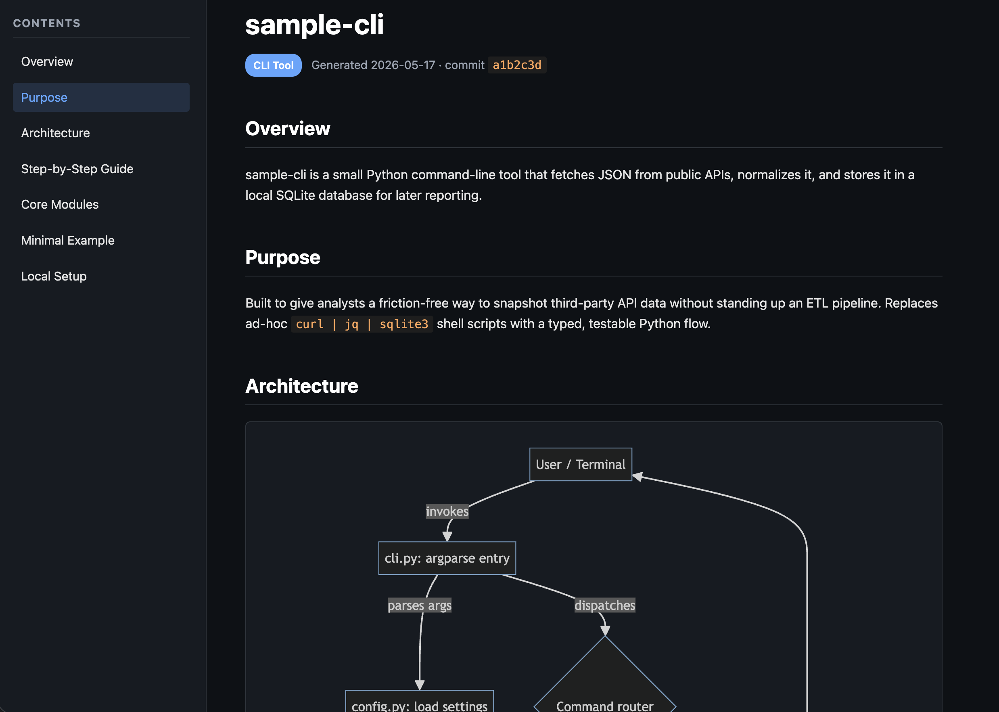

# understand-repo

A dual Claude Code + Codex skill that analyzes any repository and generates a self-contained study guide — designed with a **LiquidGlass aesthetic** (light/dark, glassmorphism, iOS-inspired) and built for both newcomers and contributors.

Drop it on an unfamiliar codebase and get a one-page visual onboarding doc: overview, architecture diagram, data-flow walkthrough, central code excerpts, extension points, and a minimal runnable example — all in a single HTML file.

Tested with Claude Code and Codex.



## What it produces

```
docs/
├── study_guide.html      # self-contained LiquidGlass HTML — light/dark, interactive
├── architecture.mmd      # Mermaid source of the architecture diagram
├── summary.md            # compressed markdown version (PR / chat / README ready)
└── index.json            # structured metadata for tooling
```

## Study guide sections

| Section | Content |
|---|---|
| Hero | Project name, type badge, commit hash, generation date |
| What & Why | What it does + why it exists (2–3 sentences) |
| Architecture | Rendered Mermaid diagram |
| How it works | Step-by-step data-flow trace, module by module |
| Key Files | Table of central files + 1-sentence role each |
| Code Deep Dive | Annotated code excerpts from the most central files |
| Extension Points | Where and how the repo can be extended or customized |
| Try it now | Minimal runnable example + local setup commands |

## UX features

- **Light / dark toggle** — respects `prefers-color-scheme` on first load; persists in `localStorage`
- **LiquidGlass aesthetic** — `backdrop-filter` blur, translucent surfaces, specular highlights, ambient color orbs
- **Lucide icons** — thin-stroke SVG icons (same set as shadcn/ui), via CDN
- **Collapsible sections** — every section can be collapsed/expanded
- **Sidebar with sub-navigation** — Key Files and Code Deep Dive expand per-file links
- **Scrollspy** — sidebar and breadcrumb track your position in real time
- **Progress bar** — shows reading progress at the top of the page
- **Copy-to-clipboard** — every code block gets a hover-activated copy button
- **Full-text search** — filters sections in real time as you type
- **Auto syntax highlighting** — highlight.js detects language per block

## Installation

### As a skill for Claude Code or Codex

For Claude Code:

```bash
git clone https://github.com/crosaless/understand-repo.git ~/.claude/skills/understand-repo
```

For Codex:

```bash
git clone https://github.com/crosaless/understand-repo.git ~/.codex/skills/understand-repo
```

Then in either agent, the skill can be triggered naturally:

```
analyze this repo and generate a study guide
```

In Codex, you can also invoke it explicitly with:

```
$understand-repo
```

In Claude Code, you can also invoke it explicitly with:

```
/skill understand-repo
```

Or use related prompts like *"generate a study guide"*, *"explain this codebase"*, or *"onboard me to this project"*.

### As a reference for other agents (Cursor, Aider, Hermes, custom)

Copy `SKILL.md` into your agent's instruction set or system prompt. The template lives in `templates/study_guide_template.html` — point your agent at it.

## Usage

From inside any repo:

```
> analyze this repo and generate a study guide
```

The skill will:

1. Scan the file tree and identity files (`README`, `package.json`, etc.).
2. Detect project type (CLI / Web App / Library / ML / Monorepo).
3. Compute a Documentation Score to choose the Extension Points strategy.
4. Identify central files by dependency fan-in/out.
5. Generate `docs/study_guide.html`, `docs/architecture.mmd`, `docs/summary.md`, and `docs/index.json`.

Open the HTML in any browser — no build step.

## Placeholders reference

The template uses `{{SNAKE_CASE}}` placeholders:

| Placeholder | Content |
|---|---|
| `{{PROJECT_NAME}}` | Repository name |
| `{{PROJECT_TYPE}}` | CLI / Web App / Library / etc. |
| `{{GENERATED_AT}}` | ISO 8601 date |
| `{{COMMIT_HASH}}` | Short git hash or `—` |
| `{{WHAT_AND_WHY}}` | HTML — overview + purpose |
| `{{MERMAID_DIAGRAM}}` | Raw Mermaid source |
| `{{HOW_IT_WORKS}}` | HTML — ordered data-flow steps |
| `{{KEY_FILES_ROWS}}` | HTML — `<tr>` rows for the files table |
| `{{CODE_DEEP_DIVE_BLOCKS}}` | HTML — `.code-module` blocks |
| `{{EXTENSION_POINTS_LIST}}` | HTML — `.ext-point` blocks |
| `{{MINIMAL_EXAMPLE}}` | Plain text snippet |
| `{{LOCAL_SETUP}}` | Plain text install + run commands |

## Extension Points strategy

The skill adapts based on how well-documented the target repo is:

- **Well-documented repo** — combines structural heuristics (abstract classes, plugin files, `@public` markers), doc analysis (README "Contributing"/"Extending" sections), and LLM inference.
- **Sparse docs** — LLM inference only, constrained to structurally obvious seams. All inferred points are marked `(inferred)` in the output.

## Customization

Edit `templates/study_guide_template.html` to change theme tokens, layout, or sections. CSS custom properties (`--accent`, `--glass-bg`, etc.) control the entire visual system — a palette change is a one-line edit per theme.

To change the output directory, ask the skill explicitly: *"generate the study guide into `wiki/` instead of `docs/`"*.

## Edge cases handled

- **Monorepos** — generates one guide per workspace under `docs/<package>/`.
- **No README** — infers purpose from package metadata; marks as `(inferred)`.
- **Large repos (>500 files)** — delegates exploration to a subagent/explorer when the host agent supports it.
- **Empty / scaffolding repos** — produces a minimal guide with next-step suggestions.

## Examples

See [`examples/`](examples/) for a sample output generated against a real repo.

## Contributing

Issues and PRs welcome. Particularly useful contributions:

- Better project-type detection heuristics.
- Additional language support for Code Deep Dive fragments.
- Adapters for other agent frameworks.

## License

MIT — see [LICENSE](LICENSE).
